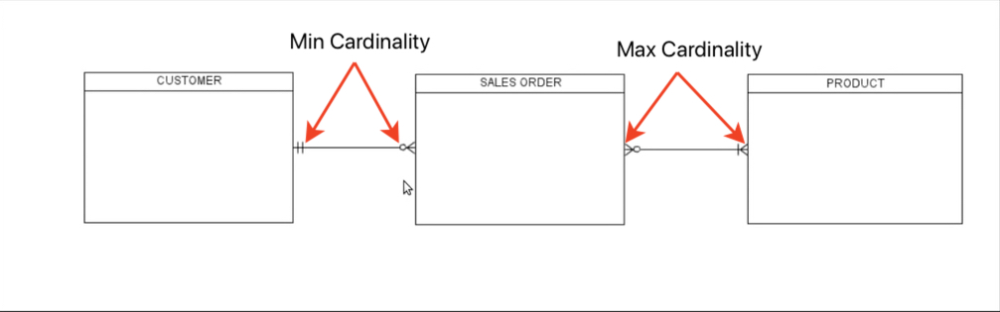
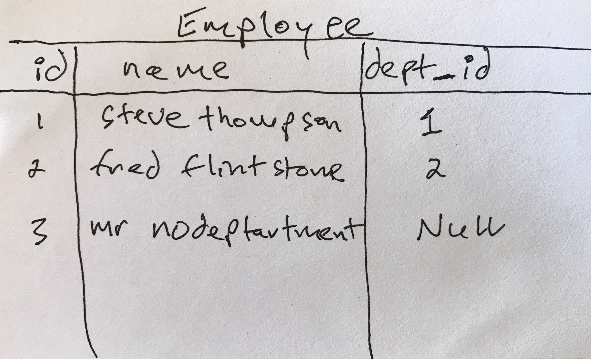

autoscale: true
build-lists: true

# [fit]What is SQL?
- Structured Query Language.
- Standard syntax of querying & manipulating data in relational databases.
- Used by many RDMS, such as ProsgreSQL, MySQL, etc.
- learning SQL is a portable skill.

# [fit]CRUD

INSERT
SELECT
UPDATE
DELETE

[Cheat Sheet](http://files.zeroturnaround.com/pdf/zt_sql_cheat_sheet.pdf)

# [fit] CREATE Syntax

```sql
CREATE TABLE customers (
    id INTEGER PRIMARY KEY AUTOINCREMENT,
    name TEXT,
    email TEXT);
    
INSERT INTO customers (name, email) VALUES ("James", "james@james.com");

```

# [fit] SELECT Syntax
```sql
-- filter your columns
SELECT col1, col2, col3, ... FROM table1 
-- filter the rows
WHERE col4 = 1 AND col5 = 2 
-- aggregate the data
GROUP by ...
-- limit aggregated data
HAVING COUNT(*) > 1 
-- order of the results
ORDER BY col2
```

# [fit] UPDATE Syntax

```sql

UPDATE table_name
SET column1=value, column2=value,...
WHERE some_column=some_value

```

# [fit] DELETE Syntax

```sql
DELETE FROM table_name
WHERE some_column = some_value
```

# [fit] What is SQLite?
- It's a RDMS.
- Doesn't require a server unlike other RDMS.
- The DB is a single file.
- Why is it good?
- What are its limits?

# [fit]Using  SQLite Directly

- When would you use SQLite directly in iOS?
- Why should we learn SQL/SQLite?
- FMDB and other SQLite wrappers.

# [fit]SQLite & Core Data

- Usually backing store in Core Data.
- What are some limitations of  Core Data?

#  [fit]SQLite Vs Realm

- Compared to Core Data.
- What are some benefits of Realm over Core Data?
- When should you use: 1.Realm, 2. Core Data, 3. SQLite directly?

# [fit] ERD
- What is it?
- Entity Relation Diagram.
- Shows data and its relationships.
- 5 Parts: Entities, Attributes, Primary Key, Relationship, Cardinality.

# [fit] Relationship
- How one or more entities interact.
- So, Person might have a relationship to the FavouriteColor entity.
- Why not just put FavouriteColor as an attribute in the Person entity?
- Cardinality is expressed in terms of Minimum/Maximum.

# [fit] Cardinality & Crows Foot Notation



[Youtube Video](https://www.youtube.com/watch?v=u2QqjofJvGo)

# [fit] SQLite Data Types

NULL
INTEGER - signed integer
REAL - 8 byte floating point integer
TEXT - UTF-8/16BE/16LE string
BLOB - binary data

# [fit] JOINS

- Combine records from more than 1 table by using some common value(s) shared between the tables.

# [fit] Employee & Department

 


# [fit] ERD
 


# [fit] Joins

- How do we list the department each employee is in?
- Do INNER JOIN on the department's `primary key` and the employee's `foreign key`.
- If we want a list of all employees with their departments whether they have one or not we would use the LEFT OUTER JOIN.
- LEFT OUTER JOIN is the same as RIGHT OUTER JOIN except the primary table joined to is reversed.

# INNER JOIN 

  

# LEFT OUTER JOIN


# [fit] Tools

[http://sqlitebrowser.org/](http://sqlitebrowser.org/)

# [fit] Joins <br>Demo

# [fit]Demo

- Insert, Update, Delete
- Get total for everything James has purchased
- Get the list of everything James has purchased using a JOIN
- Get a list of everyone and what they have purchased if anything
